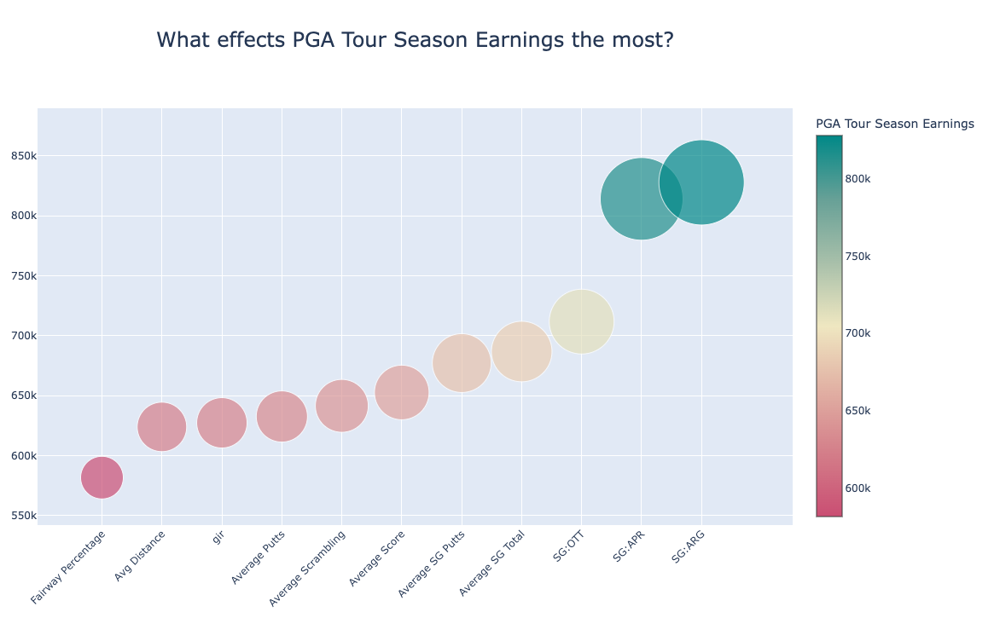

# Psychic Barnacle, How-To
Welcome to Psychic Barnacle, an honest system that understands any system. Visit our website at https://mont-ops.com for more information.

## What Psychic Barnacle Does
Input your dataset, and Barnacle does the heavy lifting, giving data analysis insight instantaneously. Using proprietary math, the insights show direct effects on an outcome. 
A good analogy for how the math works is, "If you are a player on a sports team, how well does your team do with different combinations of players while you are in the game?" 

## Prerequisites
- Make sure you have an API key for access
  - Email nik@mont-ops.com to get configured, to receive "uid"
  - Free trial starts by giving 5 successful runs, for datasets <10MB 
    - After free trial runs are over, email nik@mont-ops.com to purchase more runs at larger data sizes
- If using Python:
  - Have Python 3.6+ installed on your computer
- Alternative is to use curl

## Configuration
Once configured, define your config file that will be used as Psychic Barnacle runs.

### Necessary fields to define are:
- *uid*: a valid User ID 
- *barnacle_depth*: a dictionary object defining column "intelligent binning" depths for Barnacle to mapt with. "main": int, must be in every barnacle_depth dict. Define additional columns with individual depths, otherwise columns default to "main". Example is: 'barnacle_depth': {'main': 5, 'month': 12, 'day': 31}
- *cols_to_drop*: a list of columns not to include in analysis, but which will be included in output dataset from the api
- *data_type*: ".csv" or ".parquet"
- *path*: path to data file, i.e. data/input.csv
- *save_name*: desired save name for the outputs of Barnacle, i.e. data/successfully_barned.csv
- *target*: name of the column to understand, i.e. "Converted"
- *wait_time*: integer value, the time to give Barnacle to breathe, talk to the data gods, and give insights back in time. Good value is usually 60 (seconds)


### Optional fields to define are:
- *comments*: list of comments in return config file to note findings
- *partition_by*: column to partition dataset by and prevent data leakage. Some good examples would be "Campaign" in a Marketing campaign, "State" for a geographic healthcare dataset, etc.
- *displays*: a dictionary object with mandatory fields that help Natural Language generated insights:
  - *target*: a natural sounding target to explain the target in "Necessary Fields", i.e. for "Converted", the target here could be "Lead Converted, Yes/No"
  - *success_metric*: a natural sounding indicator of success, i.e. "Higher conversion is good"
  - *green_is_up*: for coloring, sometimes green is good, but the values need to match. On the color scale, green_is_up is True will have green as a "good value" (for example, higher Sales), otherwise False has green as lower values, which could be seen as good (for example, higher volatility is bad, therefore green should go on bottom)


## Example config file

Example use-case here is a PGA Tour dataset, understanding what player statistics led to higher earnings over the course of a season. 

```python
config = {    # PGA Tour Success
	"uid": "uid123123",  # a valid uid
	"barnacle_depth": {
		"main": 10
	},  # main is for every column, specify different depths for different columns 
	"cols_to_drop" :[
		"Player Name", 
		"Rounds", 
		"Wins", 
		"Points", 
		"Top 10", 
		"Year"
	],
	"comments": [
		"Testing Psychic Barnacle on new datasets"
	],
	"data_type": ".csv",  # Either .csv or .parquet 
	"path": "data/pga_engineered.csv",  # Path on your file system to .csv 
	"save_name": "api-runs/pga_tour.html",  # Save name for output files
	"target": "Money",  # Target column to be analyzed
	"partition_by": "Year",  # A way to partition, and prevent data leakage
	"wait_time": 60,
	"displays": {
		"target": "PGA Tour Season Earnings",
		"success_metric": "Higher earnings is good and relative to the average player",
		"green_is_top": True,  # False == Green is bottom, Red is Top
	}
}
```

## Using Python

Included is a file called run_barnacle_api.py, which contains the api run commands, and uses the requests library. In order to use, the following commands should be run in your terminal to pip install the requirements.txt.

```bash
python3 -m venv .venv
source ./.venv/bin/activate
pip install -r requirements.txt
```

Then, add the config file to run_barnacle_api.py:

```python
from run_barnacle import run_barnacle

config = {    # PGA Tour Success
	"uid": "uid123123",  # a valid uid
	"barnacle_depth": {
		"main": 10
	},  # main is for every column, specify different depths for different columns 
	"cols_to_drop" :[
		"Player Name", 
		"Rounds", 
		"Wins", 
		"Points", 
		"Top 10", 
		"Year"
	],
	"comments": [
		"Testing Psychic Barnacle on new datasets"
	],
	"data_type": ".csv",  # Either .csv or .parquet 
	"path": "data/pga_engineered.csv",  # Path on your file system to .csv 
	"save_name": "api-runs/pga_tour.html",  # Save name for output files
	"target": "Money",  # Target column to be analyzed
	"partition_by": "Year",  # A way to partition, and prevent data leakage
	"wait_time": 60,
	"displays": {
		"target": "PGA Tour Season Earnings",
		"success_metric": "Higher earnings is good and relative to the average player",
		"green_is_top": True,  # False == Green is bottom, Red is Top
	}
}

run_barnacle(config)
```

Then in Terminal:

```bash
python run_barnacle_api.py
```

After running, the file will be displayed in the save_name path specified in the config file. Either a .html document, or .csv will show up depending on desired output. This is considered a "successful" run, and will charge 1 run to the uid, either on the trial or purchased runs. 


## Interpreting Results.. It's a Powerpoint Presentation!
This process takes seconds to make.. compared to the hours, days, weeks, or months it might take to perform an analysis. Slides are ready to present to any audience, with simple explanation, honest insight, and prescriptive benefit.

### Overview
Start the power point presentation with a concise overview of what to look for in the analysis. Good to go for any client, stakeholder, explained honestly and simply.


### What to look for, Highest Impact, and Things to Note
Show the audience what to look for, establishing trust



### Example of Highly Reliable
Show the audience which fields are highly reliable, and why


### Example of Somewhat Reliable
Barnacle is honest, knowing which fields are only somewhat reliable. Let the audience know which to trust, and which only have mid-level effect.


### Example of "Other Factors at Play" 
When a field looks like it has trend, it is good to know if it is reliable or not.. In this case, there are likely other factors at play. For example, distance doesn't always equate to higher earnings on the PGA Tour, other factors such as Short Game and Scoring likely take effect on earnings.. However, Distance doesn't hurt 


### Prescription, what to do next?
Don't leave your audience hanging, what do we do with what we just learned? What's given is a concise Prescription of what we learned, and what to do with the Insights. 


## Troubleshooting

### API Key may not be recognized
Contact nik@mont-ops.com to verify or configure a valid uid

### Number of runs might be out
Trials limited to 5 runs and 10MB limit, and more runs/larger datasets are on a by-case and purchase basis. Contact nik@montops.ai to verify remaining number of runs or further details.

### Dataset might be too large
On a trial run, datasets are limited to 5 runs and 10MB to proof of concept before purchasing. If the dataset exceeds the limit, try partitioning down to a sub-set that is <10MB. 

### Timeout
On larger sets, Psychic Barnacle has to first generate Barn Effect values, then the tables, then write about them. On average that process should take less than 60 seconds, but sometimes Barnacle needs a little time to breathe.. consider adjusting the "wait_time" in your config file to a slightly higher number. 

### Other
Contact nik@mont-ops.com for further detail. Make sure you have your "key" generated from the API command so our team can help you troubleshoot for more specific issues. 

# Thank You
Thank you for reading about, supporting, and/or showing interest in Psychic Barnacle, and the Barn Effect! For anything further, please contact nik@mont-ops.com. MontOps is looking forward to seeing you in action and the insights you uncover!
